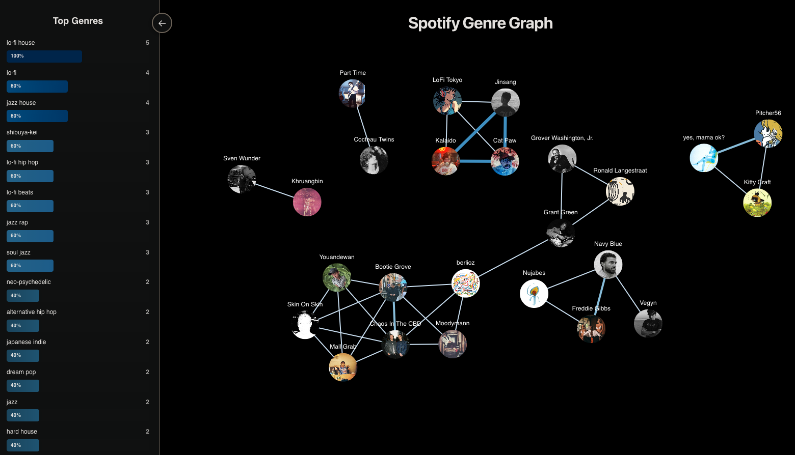

# Spotify Genre Graph

A visualization tool that creates an interactive graph of your top Spotify artists based on shared genres. Built with React and Node.js.



## Features

- Spotify OAuth authentication
- Interactive force-directed graph visualization
- Genre frequency analysis
- Real-time artist connections based on shared genres

## Prerequisites

- Node.js 18+ and npm
- Spotify Developer Account
- Spotify App credentials (Client ID and Client Secret)

## Environment Variables Setup

### Server Environment Variables

1. Create a `.env` file in the `server/` directory:

```bash
cd server
touch .env
```

2. Add the following variables to `server/.env`:

```env
# Required: Spotify API Credentials
# Get these from https://developer.spotify.com/dashboard/applications
SPOTIFY_CLIENT_ID=your_spotify_client_id_here
SPOTIFY_CLIENT_SECRET=your_spotify_client_secret_here

# Optional: Server Configuration (defaults shown)
PORT=8888
REDIRECT_URI=http://127.0.0.1:8888/callback
FRONTEND_URI=http://127.0.0.1:3000

# Optional: Node Environment
NODE_ENV=development
```

### Client Environment Variables

1. Create a `.env` file in the `client/` directory (if needed):

```bash
cd client
touch .env
```

2. Add the following variable to `client/.env` (optional):

```env
# Optional: API Base URL (defaults to http://127.0.0.1:8888)
REACT_APP_API_URL=http://127.0.0.1:8888
```

### Getting Spotify Credentials

1. Go to [Spotify Developer Dashboard](https://developer.spotify.com/dashboard/applications)
2. Log in with your Spotify account
3. Click "Create App"
4. Fill in the app details:
   - App name: Any name you want
   - App description: Optional
   - Redirect URI: `http://127.0.0.1:8888/callback`
5. After creating the app, you'll see:
   - **Client ID**: Copy this to `SPOTIFY_CLIENT_ID`
   - **Client Secret**: Click "Show Client Secret" and copy to `SPOTIFY_CLIENT_SECRET`

## Installation

1. Clone the repository (or navigate to the project directory)

2. Install all dependencies (recommended):

```bash
npm run install:all
```

## Running the Application

### Development Mode (Recommended)

**Option 1: Run both server and client together** (from project root):

```bash
npm run dev
```

This will:
- Start the server with auto-reload (nodemon) on `http://127.0.0.1:8888`
- Start the client with hot-reload on `http://127.0.0.1:3000`

**Option 2: Run separately** (in separate terminals):

**Terminal 1 - Server:**
```bash
cd server
npm run dev
```
The server will run on `http://127.0.0.1:8888` with auto-reload enabled.

**Terminal 2 - Client:**
```bash
cd client
npm start
```
The client will run on `http://127.0.0.1:3000` with hot-reload enabled.

### Production Mode

**Server:**
```bash
cd server
npm start
```

**Client:**
```bash
cd client
npm run build
npm install -g serve
serve -s build
```

### Usage

1. Click "Login with Spotify" on the homepage
2. Authorize the application with your Spotify account
3. View your personalized artist graph with genre connections

## Security Features

- Environment variables are loaded securely using `dotenv`
- State parameter validation for CSRF protection
- Secure cookie handling for OAuth state
- Proper error handling and validation
- No credentials in source code

## Code Structure

### Server (`server/`)

- `index.js` - Main Express server and route handlers
- `config.js` - Configuration and environment variable validation
- `constants.js` - Application constants (genres, limits, etc.)
- `utils/auth.js` - Authentication utilities (state generation, validation)
- `utils/spotify.js` - Spotify API integration
- `utils/graph.js` - Graph data processing utilities

### Client (`client/src/`)

- `App.js` - Main application component
- `config.js` - Client configuration
- `components/` - React components (LoginScreen, LoadingScreen, GenreChart)
- `services/api.js` - API service layer
- `utils/graphSetup.js` - Graph visualization utilities

## Technologies Used

- **Backend**: Node.js, Express, Axios
- **Frontend**: React, React Force Graph 2D, D3.js
- **Authentication**: Spotify OAuth 2.0
- **Visualization**: D3 Force Simulation

## License

MIT

